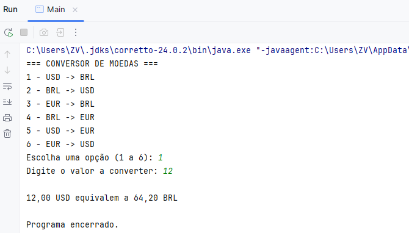

# Conversor de Moedas em Java

<p align="center">
  
</p>

Projeto desenvolvido no curso **Praticando Java** da Alura. Um conversor de moedas interativo que utiliza uma API para obter cotações em tempo real.

## Funcionalidades

- Conversão entre Reais, Dólares, Euros e outras moedas.
- Menu via console para interação com o usuário.
- Consulta de valores atualizados usando [ExchangeRate API](https://www.exchangerate-api.com/). 

## Tecnologias

- Java 24
- Maven
- Gson para manipulação de JSON
- API REST para cotações

## Como rodar

Clone o repositório:
```bash
git clone https://github.com/iamandaleao/ConversorMoedasJava.git
```
Abra o projeto em sua IDE.

Execute `Main.java` e siga as instruções no console.

> ⚠️ É necessário ter uma chave da ExchangeRate API para que o programa funcione.
---
## Autor

Desenvolvido por [Amanda Leão](https://www.linkedin.com/in/iamandaleao) como parte do curso *Praticando Java* da Alura.

---